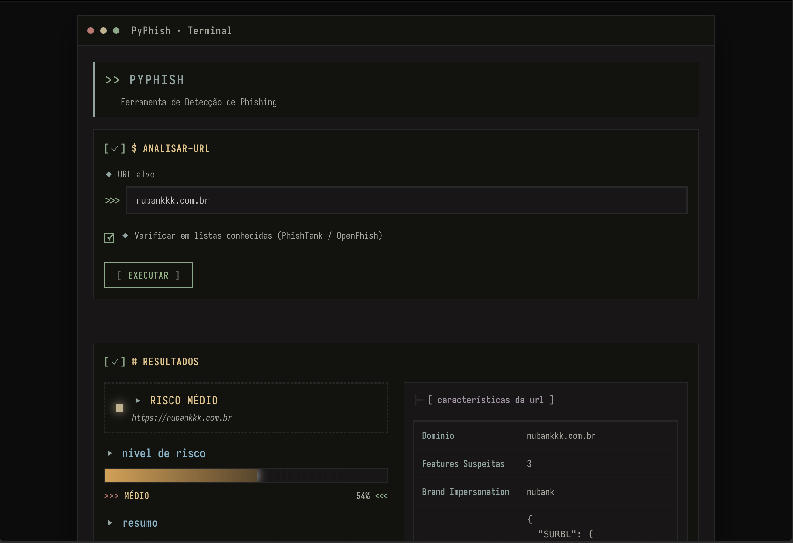
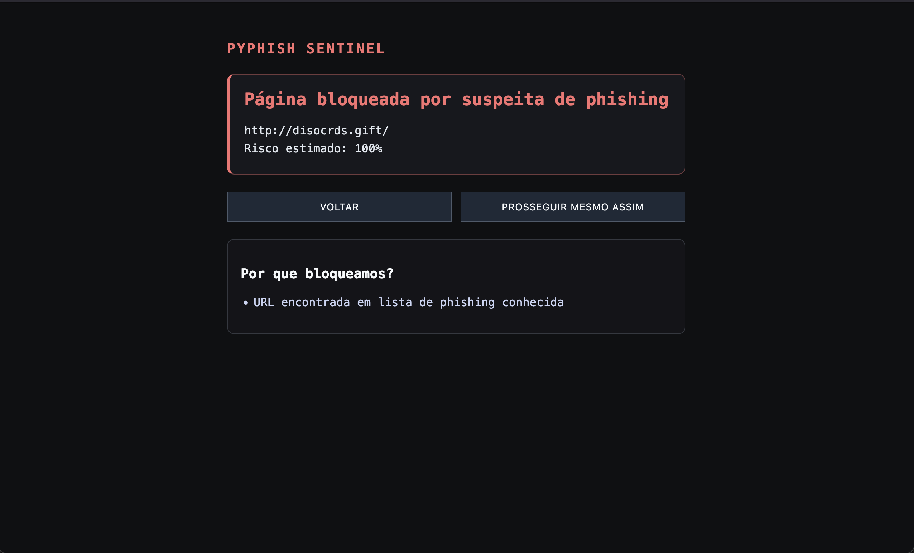
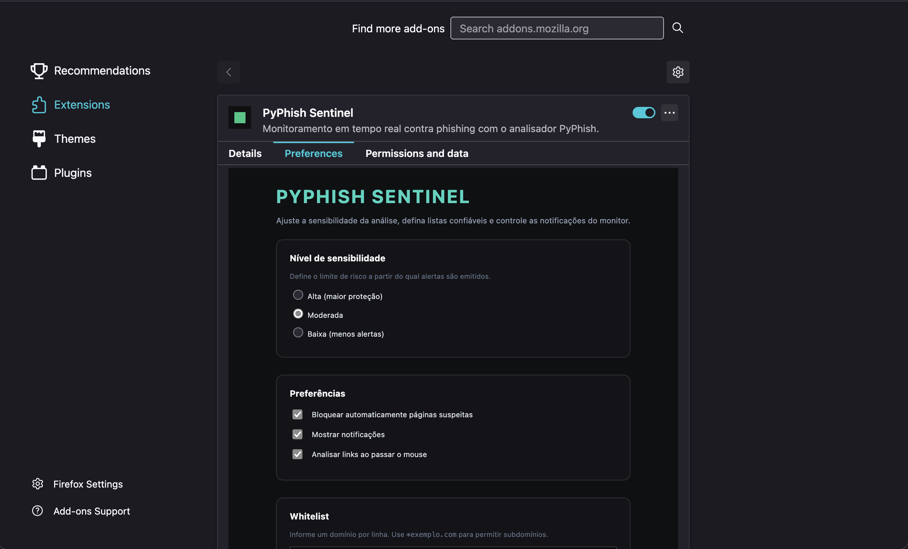

# PyPhish

Sistema de detecção de phishing composto por:

- **API Flask (`main.py`)** que expõe os endpoints `/analyze` e `/health`;
- **Extensão Firefox (`extension/`)** que consome a API para análise em tempo real;
- **Listas locais (`cache/`)** carregadas em memória para acelerar as checagens.

---

## Como executar

### Opção rápida (Docker)

```bash
docker compose up --build
```

- A API ficará acessível em `http://localhost:5000`.
- Faça um smoke test: `curl http://localhost:5000/health`.
- Interrompa com `Ctrl+C` quando terminar.

### Opção manual

```bash
python -m venv .venv && source .venv/bin/activate
pip install -r requirements.txt
python main.py
```

- Requer Python >= 3.13.
- Ajuste `SECRET_KEY` via variável de ambiente se desejar.

---

## Extensão Firefox

1. Instale `web-ext` (caso necessário) com `npm install --global web-ext`.
2. Empacote a extensão:

   ```bash
   cd extension
   web-ext build --overwrite-dest
   ```

   O `.zip` ficará em `extension/web-ext-artifacts/`.

3. Alternativa rápida: `zip -r pyphish-extension.zip extension/`.
4. Instruções completas de carregamento temporário estão em `extension/README.md`.

---

## Vídeo de demonstração

https://github.com/user-attachments/assets/8a858c6b-16c3-44e3-bdb0-5bf1abeb5cdb

## Capturas de tela







---

## Estrutura resumida

```text
pf/
├── Dockerfile
├── docker-compose.yml
├── requirements.txt
├── main.py
├── detector.py
├── analyzer.py
├── extension/
│   ├── manifest.json
│   └── ...
└── cache/
```
